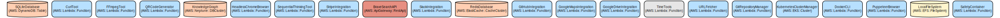

# 🧠 Meta-Optimized Hybrid Reasoning Framework  
**by Ryan Oates**  
**License: Dual — AGPLv3 + Peer Production License (PPL)**  
**Contact: ryan_oates@my.cuesta.edu**

---

## ✨ Purpose

This framework is part of an interdisciplinary vision to combine **symbolic rigor**, **neural adaptability**, and **cognitive-aligned reasoning**. It reflects years of integrated work at the intersection of computer science, biopsychology, and meta-epistemology.

It is not just software. It is a **cognitive architecture**, and its use is **ethically bounded**.

---

## 🔐 Licensing Model

This repository is licensed under a **hybrid model** to balance openness, reciprocity, and authorship protection.

### 1. For Commons-Aligned Users (students, researchers, cooperatives)
Use it under the **Peer Production License (PPL)**. You can:
- Study, adapt, and share it freely
- Use it in academic or nonprofit research
- Collaborate openly within the digital commons

### 2. For Public Use and Transparency
The AGPLv3 license guarantees:
- Network-based deployments must share modifications
- Derivatives must remain open source
- Attribution is mandatory

### 3. For Commercial or Extractive Use
You **must not use this work** if you are a:
- For-profit AI company
- Venture-backed foundation
- Closed-source platform
...unless you **negotiate a commercial license** directly.

---

## 📚 Attribution

This framework originated in:

> *Meta-Optimization in Hybrid Theorem Proving: Cognitive-Constrained Reasoning Framework*, Ryan Oates (2025)

DOI: [Insert Zenodo/ArXiv link here]  
Git commit hash of original release: `a17c3f9...`  
This project’s cognitive-theoretic roots come from studies in:
- Flow state modeling
- Symbolic logic systems
- Jungian epistemological structures

---

## 🤝 Community Contributor Agreement

If you are a student, educator, or aligned research group and want to contribute:
1. Fork this repo
2. Acknowledge the author and original framework
3. Use the “Contributors.md” file to describe your adaptation
4. Optional: Sign and return the [Community Contributor Agreement (CCA)](link) to join the federated research network

---

## 🚫 What You May Not Do

- Integrate this system into closed-source LLM deployments
- Resell it or offer derivative products without explicit approval
- Strip author tags or alter authorship metadata

---

## 📬 Contact

Want to collaborate, cite properly, or license commercially?  
Reach out: **ryan_oates@my.cuesta.edu**
# Fractal Browser: A Distributed Collective Intelligence System

Fractal Browser is a sophisticated distributed system that enables collective intelligence through fractal processing patterns, recursive analysis, and emergent pattern detection. It provides a framework for nodes to collaboratively process information, share insights, and develop collective understanding across multiple scales.

The system implements a novel approach to distributed computing by applying fractal mathematics and collective intelligence principles. It features self-similar processing at different scales, bifurcation detection for emergent patterns, and robust safety/privacy boundaries for secure information exchange between nodes.

## Repository Structure
```
.
├── src/                           # Source code root directory
│   ├── main/java                  # Java implementation 
│   │   └── com/fractal/browser/
│   │       ├── analysis/         # Analysis components for pattern recognition
│   │       ├── collective/       # Core collective intelligence implementation
│   │       │   ├── boundaries/   # Safety and privacy controls
│   │       │   ├── communication/# Node communication protocols
│   │       │   ├── core/        # Core collective node functionality
│   │       │   ├── memory/      # Distributed memory management
│   │       │   ├── processing/  # Collective processing algorithms
│   │       │   └── visualization/# Network and pattern visualization
│   │       └── util/            # Utility classes and helpers
│   └── main/python              # Python implementation
│       └── nova_act/
│           └── collective/      # Python collective intelligence modules
├── gradle/                      # Gradle build configuration
└── docs/                       # Documentation and design files
```

## Usage Instructions

### Prerequisites
- Java 21 or higher
- Python 3.9 or higher
- Gradle 8.13 or higher
- NumPy >= 1.22.2
- Pandas >= 1.3.0
- pytest >= 7.0.0

### Installation

1. Clone the repository:
```bash
git clone <repository-url>
cd fractal-browser
```

2. Install Python dependencies:
```bash
pip install -r requirements.txt
```

3. Build the Java components:
```bash
./gradlew build
```

### Quick Start

1. Initialize a collective node:
```java
CollectiveNode node = new CollectiveNode();
node.initialize();
```

2. Create a fractal processor:
```java
FractalProcessor processor = new NodeFractalProcessor();
processor.process(new SemanticInstruction("initial-value", "constant"));
```

3. Set up safety boundaries:
```java
SafetyContainer container = new SafetyContainer();
container.setSafetyLevel(3);
container.setStrictMode(true);
```

### More Detailed Examples

Pattern Recognition:
```java
PatternRecognizer recognizer = new PatternRecognizer();
Pattern pattern = recognizer.recognize(journalEntry);
```

Collective Processing:
```java
CollectiveFractalProcessor collective = new CollectiveFractalProcessor();
ProcessingResult result = collective.processCollectively(instruction, "context-id");
```

### Troubleshooting

Common Issues:
1. Node Discovery Failures
   - Error: "Unable to discover nodes"
   - Solution: Check network connectivity and ensure NodeDiscovery service is running
   ```java
   NodeDiscovery discovery = new NodeDiscovery();
   boolean available = discovery.isNodeAvailable(nodeId);
   ```

2. Safety Container Violations
   - Error: "Safety boundary violation detected"
   - Solution: Review safety level settings and content validation
   ```java
   SafetyContainer container = new SafetyContainer();
   container.setSafetyLevel(4);
   ```

## Data Flow

The system processes information through recursive fractal patterns, with data flowing from individual nodes through collective processing to emerge as shared insights.

```ascii
Input -> [Node Processing] -> [Collective Analysis] -> [Pattern Detection]
           |                        |                         |
           v                        v                         v
    Local Insights  ->    Shared Understanding  ->   Emergent Patterns
```

Key interactions:
1. Nodes process local information using fractal algorithms
2. Results are shared through the collective communication layer
3. Pattern detection identifies emergent behaviors
4. Safety boundaries enforce secure information exchange
5. Distributed memory maintains collective state
6. Meta-awareness network tracks pattern relationships
7. Visualization components render network state and patterns

## Infrastructure



The system uses the following key infrastructure components:

Lambda Functions:
- `NodeDiscovery` - Handles node discovery and availability tracking
- `CollectiveFractalProcessor` - Manages distributed processing tasks
- `SafetyContainer` - Enforces security boundaries

Storage:
- Distributed insight repository for collective memory
- Temporal indexing for time-based pattern analysis
- Shared context registry for coordination

Network:
- Bifurcation broadcast system for pattern propagation
- Synchronization protocol for state consistency
- Meta-awareness network for pattern relationships